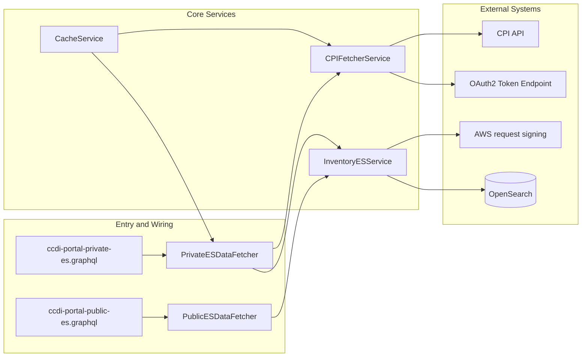

# Components

## Component Interaction Diagram

## Component List

| Component | Responsibility | Confidence |
|---|---|---|
| `PrivateESDataFetcher` | Wires private GraphQL `QueryType` fields to query handlers and CPI enrichment | **Observed** |
| `PublicESDataFetcher` | Wires public GraphQL fields and count endpoints | **Observed** |
| `InventoryESService` | Builds filter/aggregation queries and communicates with OpenSearch | **Observed** |
| `CPIFetcherService` | Gets OAuth2 token, calls CPI APIs, formats and enriches response | **Observed** |
| `CacheService` | Provides shared Caffeine cache bean | **Observed** |
| `AWSRequestSigningApacheInterceptor` | Signs outbound OpenSearch HTTP requests when AWS signing is enabled | **Observed** |
| `gov.nih.nci.bento.*` base classes | Abstract framework classes used by RI classes | **Inferred** |

## Component Hierarchy
- **Observed**: Data fetchers (`bento_ri.model`) depend on services (`bento_ri.service`).
- **Observed**: Services depend on external APIs (OpenSearch, CPI/OAuth2) and cache.
- **Inferred**: Base abstractions in `gov.nih.nci.bento.*` provide shared behavior to RI classes.

## Responsibilities
- **Observed**: `PrivateESDataFetcher` handles high-volume query categories such as participants, diagnosis, studies, cohort charts, KM plots, and manifest/metadata views.
- **Observed**: `InventoryESService` centralizes filtering rules, nested-field handling, range behavior, and aggregation construction.
- **Observed**: `CPIFetcherService` handles token retrieval, domain lookup caching, CPI request batching, and response shaping.

## Interfaces and Boundaries
- **Observed**: GraphQL contract is declared in `src/main/resources/graphql/ccdi-portal-private-es.graphql` and `src/main/resources/graphql/ccdi-portal-public-es.graphql`.
- **Observed**: Configuration boundary is `application.properties` plus environment-variable fallbacks for secrets/endpoints.
- **Unknown**: HTTP servlet/controller boundary that invokes GraphQL execution is not visible in current source tree.

## Dependency Relationships
- **Observed**: `PrivateESDataFetcher` autowires both `CPIFetcherService` and cache.
- **Observed**: `PublicESDataFetcher` and `PrivateESDataFetcher` both use `InventoryESService`.
- **Observed**: `InventoryESService` extends `ESService` from `gov.nih.nci.bento.service`.
- **Unknown**: Precise behavior of inherited base classes (`ESService`, `AbstractPrivateESDataFetcher`, `AbstractPublicESDataFetcher`) in this workspace snapshot.

## Shared Utilities
- **Observed**: Type checking helper calls (`TypeChecker`) are used to validate/cast argument values.
- **Observed**: YAML-driven query wiring is performed through `YamlQueryFactory`.
- **Observed**: Log4j2 is used across service and data fetcher classes.

## Hotspots
- **Observed**: `PrivateESDataFetcher` is large and multi-responsibility (GraphQL wiring, cache management, query orchestration, CPI integration).
- **Observed**: `InventoryESService` owns complex nested-filter and aggregation logic that can affect many query behaviors.
- **Inferred**: Changes to GraphQL schemas and filter parameter names can ripple across resolver logic, caching keys, and OpenSearch query generation.
