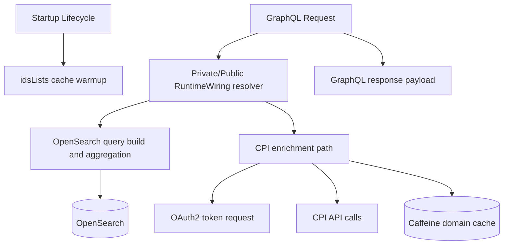

# Runtime Flows

## Purpose
This file is a bootstrap index of major runtime flow categories. It intentionally focuses on top-level paths rather than exhaustive end-to-end traces.

## Flow Diagram

## Major Flow Categories

1. Startup flow
- **Known entrypoints**: `PrivateESDataFetcher.onStartup()` (`@PostConstruct`).
- **Major stages**: preload `idsLists` cache with default batch settings.
- **Unresolved sections**: application bootstrap class and container lifecycle wiring.
- **Status**: **Observed** for preload method, **Unknown** for full startup chain.

2. GraphQL request/response flow
- **Known entrypoints**: `QueryType` definitions in private/public GraphQL schema files.
- **Major stages**: GraphQL resolver wiring in `buildRuntimeWiring()`, argument extraction, OpenSearch query execution, result shaping.
- **Unresolved sections**: HTTP ingress and GraphQL servlet/controller boundary.
- **Status**: **Observed** for schema and resolver wiring, **Unknown** for transport boundary.

3. OpenSearch filtering and aggregation flow
- **Known entrypoints**: resolver methods in `PrivateESDataFetcher` and `PublicESDataFetcher`.
- **Major stages**: `InventoryESService.buildFacetFilterQuery()`, aggregation augmentation, request dispatch, aggregation parsing.
- **Unresolved sections**: exact inherited behavior inside `ESService.send()` and other base methods.
- **Status**: **Observed** in RI query-builder code, **Unknown** for base-class internals.

4. CPI enrichment flow
- **Known entrypoints**: `PrivateESDataFetcher` CPI integration path (`fetchAssociatedParticipantIds`).
- **Major stages**: OAuth2 token fetch, domain map fetch/cache, CPI associated ID call, response merge with domain metadata.
- **Unresolved sections**: external CPI API contractual guarantees and retry/backoff policy.
- **Status**: **Observed** in service code, **Unknown** for external reliability semantics.

5. Cache usage flow
- **Known entrypoints**: `CacheService` bean + resolver/service cache reads.
- **Major stages**: cache-key generation, read-through behavior for ids lists and domains, startup warmup.
- **Unresolved sections**: memory sizing assumptions and production hit/miss metrics.
- **Status**: **Observed** for code paths, **Unknown** for operational tuning.

6. Background/scheduled/event flow
- **Known entrypoints**: none confirmed beyond startup preload hook.
- **Major stages**: not confirmed.
- **Unresolved sections**: any scheduled jobs or queue/event consumers.
- **Status**: **Unknown**.
