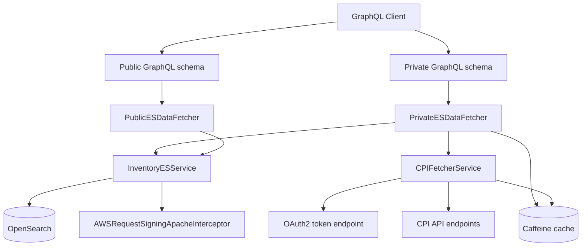

# System Overview

## System Design Diagram

## Purpose
- **Observed**: This repository provides backend query/data-fetch logic for CCDI C3DC through GraphQL schema wiring and OpenSearch/CPI integrations.
- **Observed**: Core implementation classes are under `src/main/java/gov/nih/nci/bento_ri` with supporting AWS request signing in `src/main/java/com/amazonaws/http`.

## System Scope
- **Observed**: The project packages as a WAR (`pom.xml` has `<packaging>war</packaging>`).
- **Observed**: GraphQL schema files exist for private and public ES paths in `src/main/resources/graphql`.
- **Observed**: CPI enrichment logic exists in `CPIFetcherService` and is consumed by `PrivateESDataFetcher`.
- **Unknown**: Full request ingress (HTTP servlet/controller layer) is not in the current `src/main/java` tree.

## Tech Stack
- **Observed**: Java 21, Spring Boot 3.4.x, Spring Framework 6.2.x (`pom.xml`).
- **Observed**: GraphQL Java (`graphql-java`) and Neo4j GraphQL dependency (`neo4j-graphql-java`).
- **Observed**: OpenSearch REST clients, AWS SDK signing support, Caffeine cache, Jedis.
- **Observed**: Logging with Log4j2 (`src/main/resources/log4j2.xml`).

## Startup Model
- **Observed**: `PrivateESDataFetcher` uses `@PostConstruct` to preload `idsLists` cache on startup.
- **Observed**: `src/main/webapp/WEB-INF/web.xml` defines welcome files for a web deployment.
- **Inferred**: Runtime is Spring-managed and intended for servlet container deployment (WAR + Tomcat image in `Dockerfile`).
- **Unknown**: The Spring Boot application bootstrap class and servlet registration classes are not present in this source snapshot.

## Major Subsystems
- **Observed**: GraphQL runtime wiring (`PrivateESDataFetcher`, `PublicESDataFetcher`).
- **Observed**: OpenSearch query construction and aggregation (`InventoryESService`).
- **Observed**: CPI OAuth2/token + associated-participant enrichment (`CPIFetcherService`).
- **Observed**: Shared in-memory caching (`CacheService` + injected `Cache<String, Object>`).

## Data/Storage Overview
- **Observed**: OpenSearch is queried through REST endpoints such as `/participants/_search`, `/diagnoses/_search`, and related indexes.
- **Observed**: Caffeine in-memory cache stores computed datasets and CPI domains.
- **Inferred**: Redis settings are retained for broader framework compatibility, though this repository's added classes primarily use Caffeine directly.

## External Integrations
- **Observed**: OpenSearch (with optional AWS request signing through `AWSRequestSigningApacheInterceptor`).
- **Observed**: CPI endpoints (`cpi.api.url`, `cpi.domains.url`) and OAuth2 token endpoint (`cpi.oauth2.token.uri`).
- **Observed**: Environment variables are supported for secrets and endpoint configuration.

## Key Architectural Patterns
- **Observed**: Resolver/data-fetcher centric GraphQL wiring via `RuntimeWiring`.
- **Observed**: Service-layer query builder pattern (`InventoryESService`) reused across many query handlers.
- **Observed**: Cache-aside style reads in resolver logic (`idsLists` and CPI domain cache).
- **Inferred**: This repository acts as a customization layer (`bento_ri`) on top of a broader Bento base framework (`gov.nih.nci.bento.*`).

## Risks and Unknowns
- **Observed**: `README.md` and `CPI_FETCHER_README.md` mention classes/paths (for example `gov.nih.nci.bento.controller.CPIController`) not present in current source.
- **Observed**: `src/main/java/gov/nih/nci/bento` is empty while many imports/tests reference `gov.nih.nci.bento.*`.
- **Unknown**: Whether missing base classes are provided at build/runtime by another module, generated sources, or an omitted subtree.
